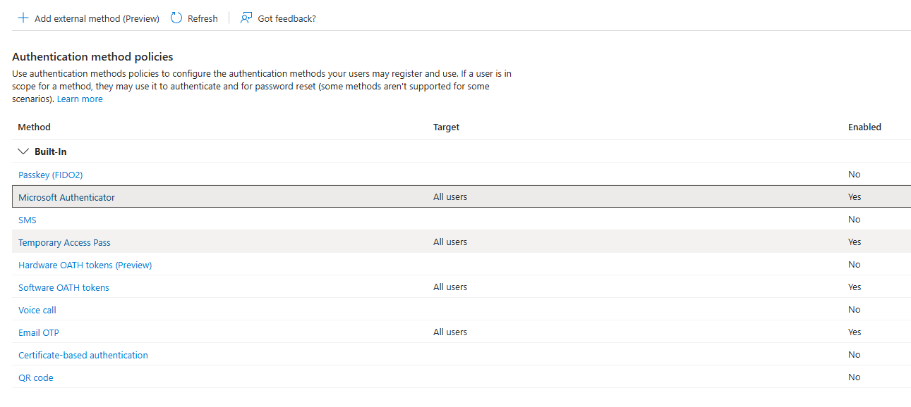

## Tenant Overview

This project was conducted in a dedicated Microsoft 365 Business tenant created specifically for identity security testing and Conditional Access validation. The tenant represents a small-to-medium enterprise (SME) environment using Microsoft Entra ID as the primary identity provider and Microsoft 365 workloads for user access.

The environment was intentionally kept minimal to ensure that all observed behaviors, policy outcomes, and sign-in events could be clearly attributed to Conditional Access configuration decisions rather than background platform noise or inherited legacy settings.

---

## Tenant Characteristics

- **Tenant Type:** Microsoft 365 Business
- **Identity Provider:** Microsoft Entra ID (cloud-only)
- **Licensing:**
  - Microsoft 365 Business Standard (trial)
  - Microsoft Entra ID P2 (trial) – required for Conditional Access
- **Directory State:** Newly created tenant with no pre-existing policies
- **User Model:** Native cloud users only (no Microsoft personal accounts or hybrid identities)

This configuration mirrors how many organizations deploy Microsoft 365 without on-premises Active Directory dependencies.

---

## Authentication & Identity Baseline

At baseline, the tenant was configured with modern authentication controls and no known identity weaknesses:

- Multifactor authentication (MFA) was available and properly configured
- Microsoft Authenticator was enabled as a primary authentication method
- Conditional Access policies were defined to require MFA for interactive user sign-ins
- No users were excluded from Conditional Access enforcement at baseline
- Sign-in logs showed successful MFA-protected authentications with no anomalous activity

These controls established a secure starting point before any misconfiguration was introduced.

---

## Scope Definition

### In Scope
- Microsoft Entra ID Conditional Access
- MFA enforcement and authentication behavior
- Interactive user sign-in telemetry
- Identity misconfiguration and exception handling

### Out of Scope
- Endpoint compromise or malware activity
- Email phishing or credential harvesting
- Azure infrastructure workloads
- Microsoft Sentinel or SIEM correlation

This project intentionally focuses on **identity-layer failures caused by configuration decisions**, rather than external attack techniques.

---

## Baseline Evidence

The following evidence documents the secure baseline state of the tenant prior to the introduction of any Conditional Access misconfiguration.

### Evidence 1.1 – Tenant Overview (Baseline)
Shows the Microsoft Entra ID tenant details, directory state, and enabled licensing at project start.

---

### Evidence 1.2 – Authentication Methods Configuration
Demonstrates that modern authentication methods, including Microsoft Authenticator, were enabled and available to users at baseline.

---

### Evidence 1.3 – Baseline Sign-In Logs
Confirms successful interactive sign-ins protected by MFA prior to any Conditional Access exclusions or misconfigurations.

