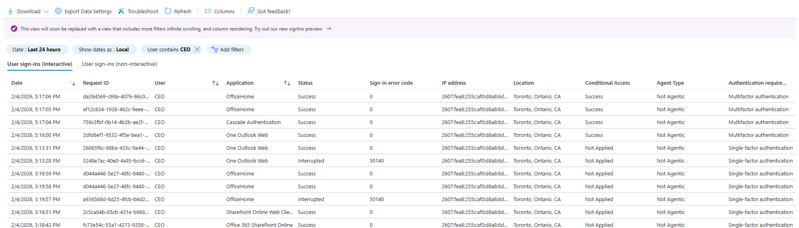

# Incident Response – Recovery

This section documents the recovery actions taken after remediation to restore secure and stable authentication operations for the affected executive account.

Recovery focuses on **restoring normal business access and validating control effectiveness**, rather than making additional configuration changes.

---

## Recovery Objectives

- Restore secure access for the affected executive account
- Re-establish a functional multifactor authentication (MFA) method
- Confirm Conditional Access enforcement remains intact
- Return the tenant to a stable, compliant authentication state

---

## Recovery Actions

Following removal of the Conditional Access exception, recovery actions addressed the underlying usability issue that originally prompted the policy exclusion.

### MFA Method Re-Enrollment

The affected user (CEO) completed re-enrollment of multifactor authentication using a new trusted mobile device. Microsoft Authenticator was successfully configured and validated as the primary MFA method.

This action restored secure access **without reintroducing Conditional Access exceptions**, preserving both usability and security.

---

## Recovery Evidence

### Evidence 6.1 – MFA Restored on Executive Account

This evidence confirms that a functional MFA method was successfully re-established on a new mobile device for the CEO account.

---

## Post-Recovery Validation

Post-recovery validation was performed to ensure that Conditional Access enforcement was fully re-applied and that the CEO account could no longer authenticate using single-factor authentication.

### Evidence 6.2 – Conditional Access Applied and MFA Enforced

This evidence shows successful CEO sign-ins where:
- Conditional Access evaluation is applied
- Authentication requirement is multifactor authentication

---

## Recovery Outcome

- Conditional Access evaluated successfully for the affected account
- MFA challenges were enforced during interactive sign-ins
- No further single-factor authentication events were observed
- No Conditional Access exclusions were required to maintain access

The tenant was returned to a **secure and stable authentication state** with full Conditional Access enforcement for all users, including high-value executive identities.

This phase confirms that the incident was resolved by addressing the root usability issue rather than relying on weakened security controls.
