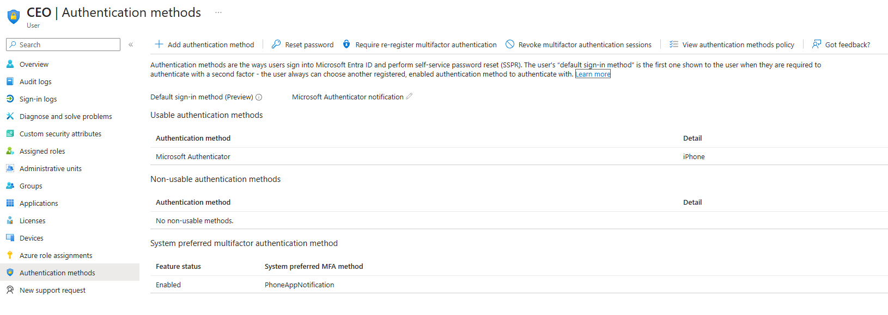

# Incident Response – Recovery

This section documents the recovery actions taken after containment of the Conditional Access misconfiguration. The objective of recovery was to restore **secure normal operations** for the affected user while ensuring that identity protections remained fully enforced.

Recovery focuses on usability and stability following incident containment, rather than immediate risk elimination.

---

## Recovery Objective

- Restore secure access for the affected executive account
- Re-establish a functional multifactor authentication (MFA) method
- Ensure Conditional Access enforcement remains intact
- Return the environment to a stable, compliant authentication state

---

## Recovery Actions Taken

Following removal of the Conditional Access exception, recovery actions were performed to address the underlying usability issue that originally prompted the policy exclusion.

### MFA Method Re-Enrollment

The affected user (CEO) completed re-enrollment of multifactor authentication using a new trusted mobile device. Microsoft Authenticator was successfully configured and validated as the primary MFA method.

This action eliminated the need for any Conditional Access exceptions while preserving business continuity.

---

## Recovery Evidence

### Evidence 6.1 – MFA Restored on Executive Account

This evidence confirms that a functional MFA method was successfully re-established on a new mobile device for the CEO account.

---

## Post-Recovery Validation

After MFA re-enrollment, validation was performed to confirm that Conditional Access enforcement was re-applied and that the CEO account could no longer authenticate using single-factor authentication.

### Evidence 6.2 – Conditional Access Applied and MFA Enforced (Post-Recovery)

This evidence shows successful CEO sign-ins where:
- Conditional Access evaluation is applied successfully
- Authentication requirement is multifactor authentication

---

## Recovery Outcome

- Conditional Access evaluated successfully for the affected account
- MFA challenges were enforced during interactive sign-ins
- No further single-factor authentication events were observed
- No Conditional Access exclusions were required to maintain access

The environment was returned to a secure and stable state with full Conditional Access enforcement and functional MFA for all users, including high-value executive identities.

This incident highlights the importance of resolving root usability issues rather than relying on policy exceptions that weaken security controls.
