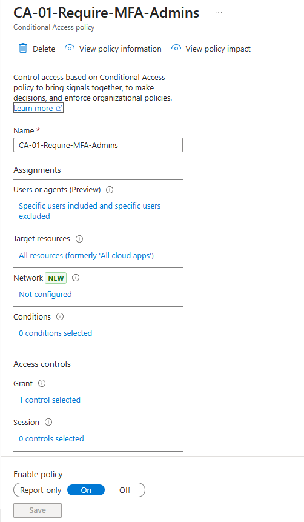
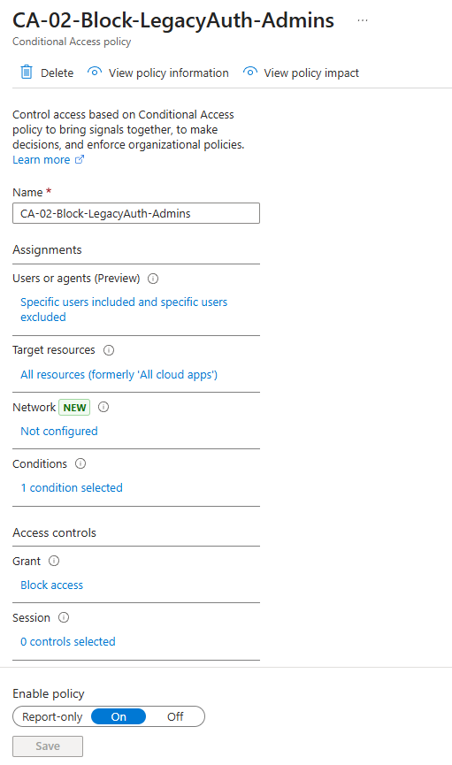
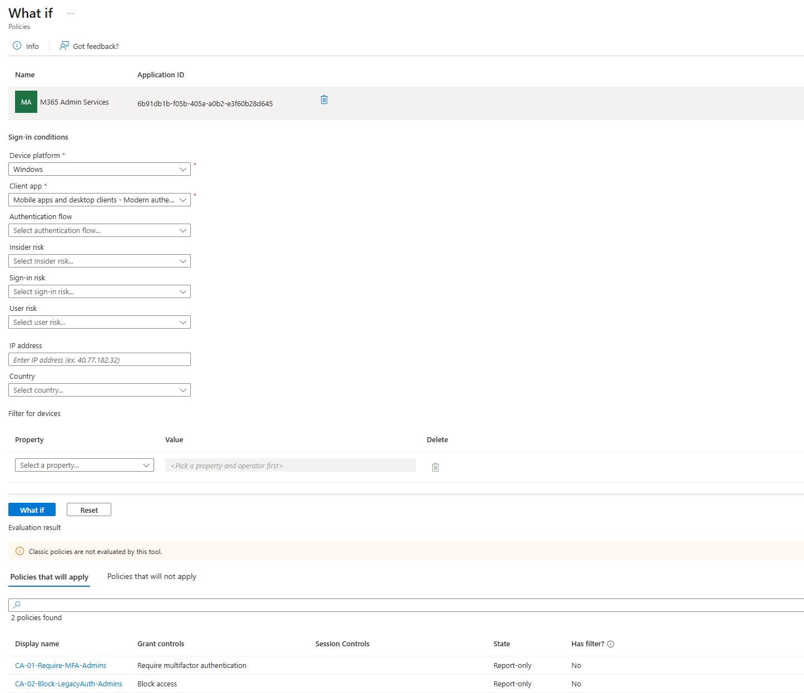

# Conditional Access – Administrative Baseline

## Purpose

This document defines the baseline **Conditional Access (CA)** controls applied to administrative accounts within the tenant.

The objective is to:
- Enforce strong authentication for all administrative access
- Block legacy authentication paths commonly abused in account compromise
- Preserve tenant recoverability through explicitly excluded break-glass accounts

These controls align with **Zero Trust**, **least privilege**, and Microsoft security best practices.

---

## Scope

**Targeted users**
- Administrative accounts scoped via the `SEC-CA-Admins` security group

**Explicit exclusions**
- Emergency access accounts contained in `SEC-BreakGlass`

**Targeted applications**
- All cloud applications
- Microsoft 365 Admin Services

---

## Conditional Access Policies

---

## CA-01 – Require MFA for Admins

**Policy name**  
`CA-01-Require-MFA-Admins`

**Purpose**  
Ensures all administrative sign-ins require multi-factor authentication, reducing the risk of credential theft and unauthorized access.

**Assignments**
- Include: `SEC-CA-Admins`
- Exclude: `SEC-BreakGlass`

**Target resources**
- All cloud apps

**Access controls**
- Grant access
- Require multi-factor authentication

**Enforcement state**
- Enabled (On)

**Evidence**

---

## CA-02 – Block Legacy Authentication for Admins

**Policy name**  
`CA-02-Block-LegacyAuth-Admins`

**Purpose**  
Blocks legacy authentication protocols that bypass modern security controls and MFA enforcement.

**Assignments**
- Include: `SEC-CA-Admins`
- Exclude: `SEC-BreakGlass`

**Target resources**
- All cloud apps

**Conditions**
- Client apps:
  - Exchange ActiveSync clients
  - Other legacy authentication clients

**Access controls**
- Block access

**Enforcement state**
- Enabled (On)

**Evidence**

---

## Policy Validation

Prior to enforcement, both policies were evaluated using the **Conditional Access What If tool** to confirm correct scope and prevent unintended lockout.

**Validation details**
- User: `sec.admin`
- Application: Microsoft 365 Admin Services
- Result: Both policies applied successfully in report-only mode before enforcement

**Evidence**

---

## Security Rationale

- Administrative accounts represent the highest-risk identities
- Legacy authentication bypasses MFA and modern protections
- Break-glass exclusions ensure tenant recovery if Conditional Access or identity services fail

---

## Summary

These Conditional Access policies establish a hardened administrative access baseline by:

- Enforcing MFA for all admin access
- Eliminating legacy authentication attack paths
- Preserving emergency access through controlled exclusions

This layer operates alongside **Privileged Identity Management (PIM)** to ensure administrative access is **just-in-time, strongly authenticated, and fully auditable**.
