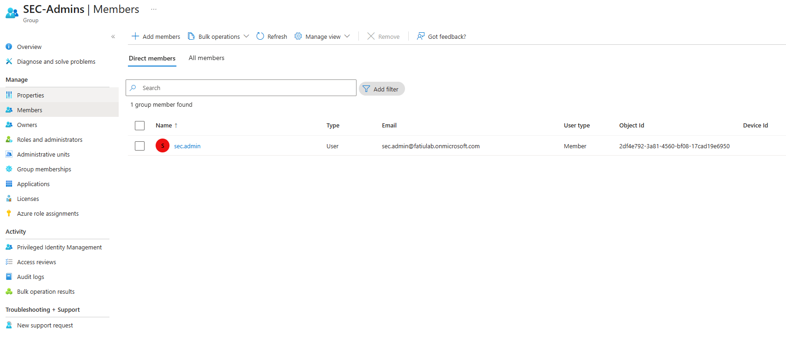
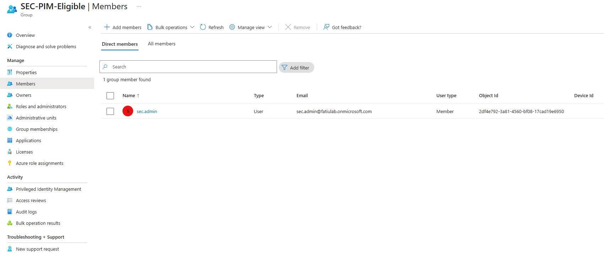
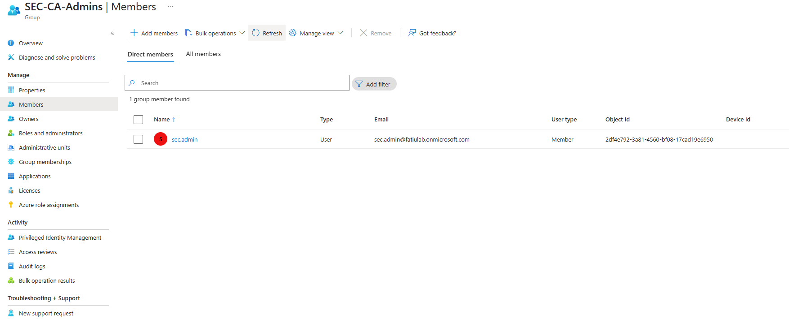
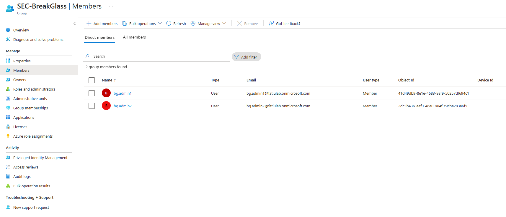
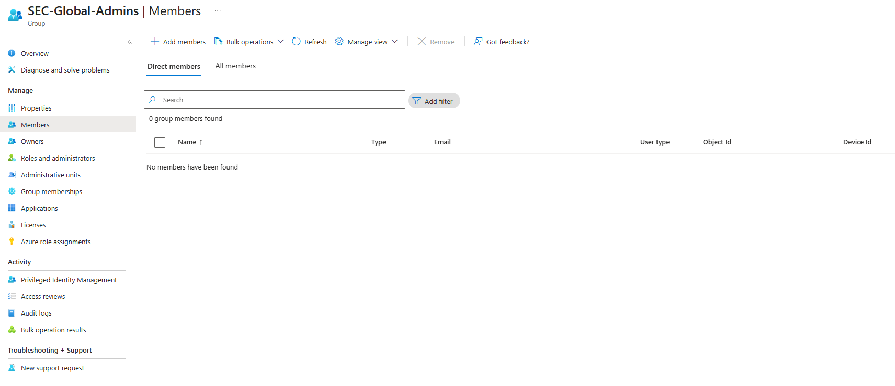
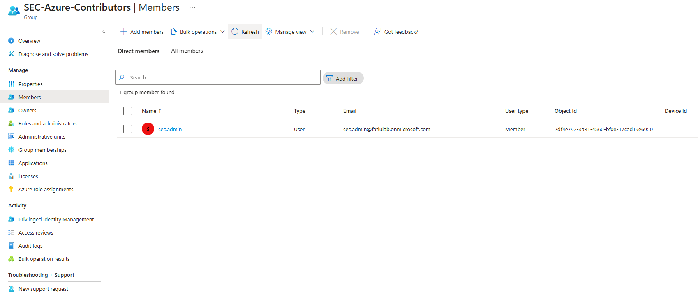

# Security Groups Design & Governance

## Purpose
This document defines the security group model used to support **Privileged Identity Management (PIM)**, **Conditional Access**, **Azure RBAC**, and **identity governance** within the tenant.

All privileged access is mediated through **security groups**, not direct user-to-role assignments. This improves scalability, auditability, and alignment with Zero Trust and least-privilege principles.

---

## Design Principles
- No standing privileged access for human administrator accounts
- Group-based access control instead of direct user assignment
- Clear separation between:
  - Identity governance
  - Role abstraction
  - Emergency access
- All privileged access is:
  - Just-in-time
  - Justified
  - Logged and auditable

---

## Security Group Inventory

## 1. SEC-Admins
**Purpose:**  
Represents the security administration team responsible for day-to-day security operations. Members of this group do **not** have permanent administrative privileges.

**Members:**
- `sec.admin`

**Evidence:**

---

## 2. SEC-PIM-Eligible
**Purpose:**  
Defines which users are eligible to request privileged roles via **Privileged Identity Management (PIM)**. This group acts as the governance gate for privileged access.

**Members:**
- `sec.admin`

**Evidence:**

---

## 3. SEC-CA-Admins
**Purpose:**  
Used to scope **Conditional Access** policies targeting administrative accounts.

**Members:**
- `sec.admin`

**Explicit Exclusions:**
- Break-glass accounts are intentionally excluded.

**Evidence:**

---

## 4. SEC-BreakGlass
**Purpose:**  
Contains emergency access accounts used only for tenant recovery scenarios.

Break-glass accounts:
- Retain permanent Global Administrator privileges
- Are excluded from Conditional Access and PIM
- Are protected by long, complex passwords stored offline

**Members:**
- `bg.admin1`
- `bg.admin2`

**Evidence:**

---

## 5. SEC-Global-Admins
**Purpose:**  
Acts as a **role abstraction layer** for the Global Administrator role.

This group is intentionally kept **empty** and exists to:
- Support group-based role assignment
- Enable scalable privilege management
- Separate identity eligibility from role assignment

**Members:**
- None (by design)

**Evidence:**

---

## 6. SEC-Azure-Contributors
**Purpose:**  
Used for Azure RBAC assignments following least-privilege principles. Azure permissions will be assigned to this group instead of individual users.

**Members:**
- `sec.admin`

**Evidence:**

---

## Governance & Audit Considerations
- All group memberships are explicitly assigned and documented
- Privileged access is time-bound, justified, and logged via Entra ID and PIM
- Group-based access control supports access reviews, investigations, and compliance audits (ISO 27001 / NIST / SOC)

---

## Summary
This security group architecture establishes a strong foundation for **PIM**, **Conditional Access**, **Azure RBAC**, and a **Zero Trust identity model**. It ensures **no standing human privilege**, while maintaining secure emergency access and full auditability.
