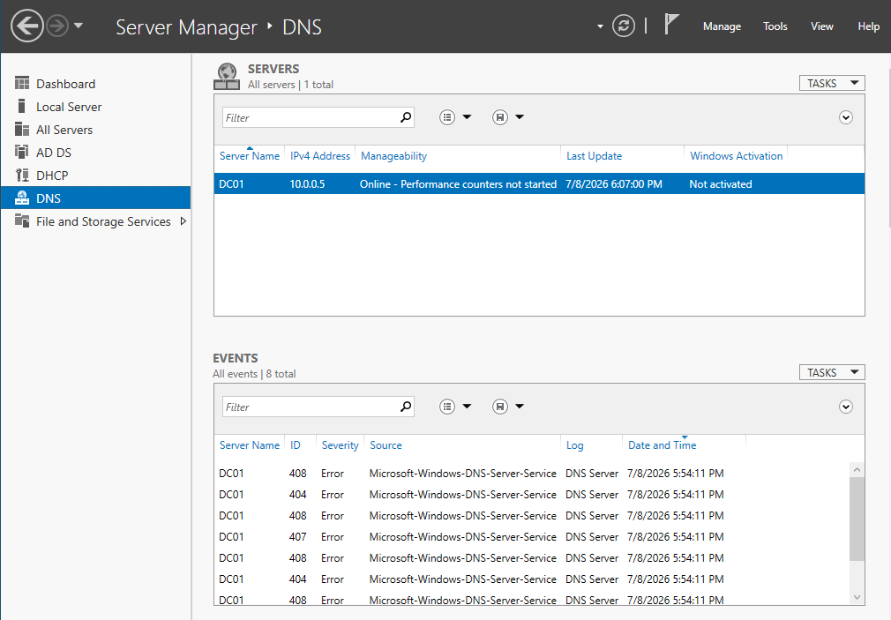
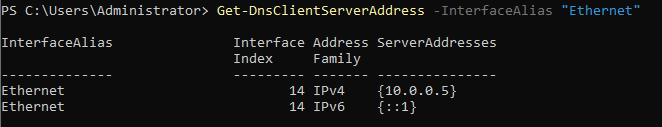
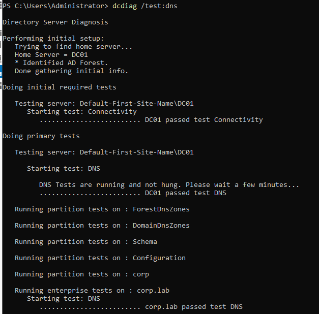
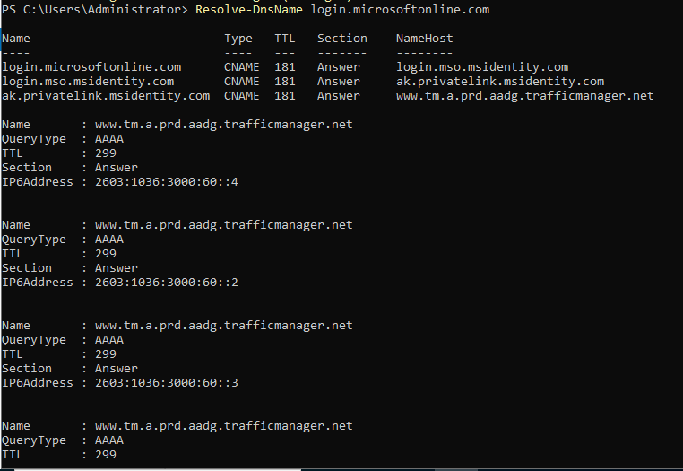

# Troubleshooting Notes — Phase 1

## Case 01 — DNS Service Failure After Domain Controller IP Change

### Symptom

After changing the domain controller's static IP address (from an initial `10.10.10.10` to `10.0.0.5` to align with the host subnet and add a default gateway), the DNS Server service began generating errors. Server Manager's events pane, which had previously shown zero errors, showed eight new `Microsoft-Windows-DNS-Server-Service` errors — event IDs 404, 407, and 408 — all timestamped immediately after the IP change.

### Root Cause

During the IP reconfiguration, the network adapter's DNS setting was left pointing at an external public resolver (`8.8.8.8`) rather than at the domain controller itself. A domain controller **is** the authoritative DNS server for its own domain (`corp.lab`). When its adapter DNS points to an external resolver, the DC attempts to resolve its own domain records against a server that has no knowledge of `corp.lab`, and the DNS Server service fails to operate correctly — producing the 404/407/408 errors.

The underlying principle: a DC must resolve internal domain records itself and must **not** rely on an external resolver for its own domain. External name resolution is a separate need, solved differently (see resolution).

### Resolution

Two-part fix that separates internal and external resolution:

1. **Adapter DNS set to self-reference.** The network adapter's preferred DNS was set to the DC's own static IP (`10.0.0.5`), with the IPv6 loopback (`::1`) as the equivalent for IPv6. This ensures the DC resolves `corp.lab` records against its own authoritative zones.

   ```powershell
   Set-DnsClientServerAddress -InterfaceAlias "Ethernet" -ServerAddresses ("10.0.0.5","127.0.0.1")
   ```

2. **DNS forwarders added for external resolution.** Rather than placing a public resolver on the adapter (the original mistake), public DNS servers were added as **forwarders** inside the DNS console (DC01 Properties → Forwarders). This is the correct mechanism: the DC resolves internal records itself and forwards any query it is not authoritative for (such as Microsoft cloud endpoints) out to the forwarders.

   ```powershell
   Add-DnsServerForwarder -IPAddress 8.8.8.8, 8.8.4.4
   ```

3. **Service restart and stale record cleanup.** Because the IP had changed, DNS registration was refreshed so AD's own records pointed at the new address rather than the old one.

   ```powershell
   Restart-Service DNS
   ipconfig /registerdns
   Restart-Service netlogon
   ```

### Verification

`dcdiag /test:dns` passed at both server and enterprise level:

- DC01 passed test Connectivity
- DC01 passed test DNS
- corp.lab passed test DNS (across ForestDnsZones, DomainDnsZones, Schema, Configuration partitions)

External resolution confirmed working through the forwarder:

```powershell
Resolve-DnsName login.microsoftonline.com
```

Returning valid addresses confirmed the DC can reach the Microsoft endpoints that Entra Connect requires in Phase 2. No new DNS-Server-Service errors were generated after the fix.

### Lesson / Takeaway

The correct DNS configuration for a domain controller separates two jobs:

- **Adapter DNS → itself** — so the DC resolves its own domain authoritatively.
- **DNS forwarder → public resolver** — so the DC resolves everything else by forwarding.

Placing a public resolver directly on the adapter conflates these and breaks authoritative resolution for the domain. This is a common configuration error and a frequent root cause of hybrid identity failures that surface later in confusing ways — Entra Connect and hybrid join both depend on clean DNS, so this was resolved and verified before proceeding.

### Evidence

*Click any image to view full size.*

**Symptom — eight DNS-Server-Service errors (408 / 404 / 407) appear immediately after the IP change**

[](./screenshots/breakfix-01-dns-errors-after-ip-change.png)

**Fix — adapter DNS corrected to self-reference (10.0.0.5 / ::1)**

[](./screenshots/breakfix-02-dns-corrected-selfreference.png)

**Verification — dcdiag /test:dns passing at server and enterprise level**

[](./screenshots/breakfix-03-dcdiag-dns-passed.png)

**Verification — external resolution confirmed working through the forwarder**

[](./screenshots/breakfix-04-external-resolution-working.png)
