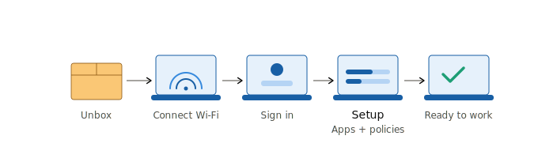

# Hybrid Autopilot & Identity-Driven Device Provisioning

### Windows Autopilot · Hybrid Azure AD Join · Microsoft Entra ID · Entra Connect · Intune · Dynamic Groups · Conditional Access · PIM

End-to-end zero-touch Windows device provisioning built on hybrid identity infrastructure. A sealed device ships to an employee, and on first sign-in it is domain-joined, registered in Entra ID, enrolled in Intune, and provisioned with department-specific applications, policies, and access — with no IT technician ever touching the machine.

This project builds the complete hybrid identity chain from the ground up in a controlled lab, with every architectural decision made deliberately and documented, and every phase carrying evidence and real troubleshooting.

---

## The Provisioning Story

**From the employee's perspective** — they unbox a device, connect to Wi-Fi, sign in with their work account, and a few minutes later have a fully configured machine with the right apps and access for their role.

**Behind the scenes** — a chain of on-premises and cloud services collaborate: the device's hardware identity is matched to the tenant, the user is authenticated, the device is domain-joined and cloud-registered, and the user's department drives everything that gets installed and granted.

**The full trust chain** — on-premises Active Directory is the source of truth, synchronized to Entra ID, which drives device provisioning and identity-based governance:

---

## Why Hybrid

This project deliberately implements the **hybrid** identity model (on-premises AD synchronized to Entra ID, devices both domain-joined and cloud-registered) rather than cloud-native, because it demonstrates the full identity chain and reflects the reality of most enterprises that still run on-premises infrastructure alongside cloud services. The hybrid model is more technically demanding — it introduces synchronization timing, domain-controller line-of-sight requirements, and the Intune Connector for Active Directory — and troubleshooting those dependencies is a core skill the project sets out to prove.

---

## Build Phases

The project is built in sequential phases. Each phase folder contains its own README with decisions, steps, evidence, and troubleshooting notes.

| Phase | Focus | Status |
|---|---|---|
| [Phase 1 — ADDS Foundation](./01-adds-foundation/README.md) | Domain controller, OU design, department-attributed users | Complete |
| [Phase 2 — Entra Connect Sync](./02-entra-connect-sync/README.md) | Directory synchronization, PHS, OU scoping, least-privilege accounts | Complete |
| [Phase 3 — Hybrid Azure AD Join](./03-hybrid-join/README.md) | Device dual identity, SCP, server-registration hardening | Complete |
| [Phase 4 — Windows Autopilot](./04-autopilot-hybrid-profile/README.md) | Intune Connector, hardware hash, hybrid deployment profile | In Progress |
| [Phase 5 — Dynamic Groups & Assignment](./05-dynamic-groups-and-assignment/README.md) | Department-driven apps, policies, Conditional Access | Planned |
| [Phase 6 — PIM for Admin Roles](./06-pim-for-admin-roles/README.md) | Just-in-time privileged access | Planned |
| [Phase 7 — Test & Break/Fix](./07-test-and-breakfix/README.md) | Full flow validation, timing analysis, failure injection | Planned |

---

## Key Design Decisions

Each of these is documented in depth in its phase folder:

- **Hybrid over cloud-native** — to demonstrate the full identity chain and reflect real enterprise environments.
- **Password Hash Synchronization** — the modern, resilient default that also enables cloud security features. See [auth-method-decision.md](./02-entra-connect-sync/auth-method-decision.md).
- **Least privilege throughout** — Hybrid Identity Administrator (not Global Admin) for the cloud admin, a dedicated connector account (not Domain Admin) for sync, and privileged OUs excluded from synchronization. See [sync-scope-config.md](./02-entra-connect-sync/sync-scope-config.md).
- **Device registration scoped to clients** — servers and domain controllers deliberately excluded from hybrid join, following the principle that device registration is a client-endpoint feature. See [Phase 3 troubleshooting notes](./03-hybrid-join/troubleshooting-notes.md).

---

## Lab Environment

| Component | Role |
|---|---|
| DC01 | Domain controller (AD DS, DNS, DHCP) — `corp.lab` |
| SYNC01 | Member server running Entra Connect and the Intune Connector for AD |
| WIN11-USER01 | Windows 11 Pro test client (hybrid-joined) |
| Entra ID tenant | Cloud identity, verified custom domain `fjlab.ca` |

All infrastructure runs as virtual machines on a Hyper-V host. The host is the persistent environment; VMs are disposable and can be rebuilt without losing documentation.

---

## Troubleshooting Highlights

Real problems encountered and resolved during the build — the diagnostic depth is documented per phase:

- **DNS service failure after a DC IP change** — diagnosed via event log, root-caused to a broken self-reference, resolved with proper forwarder configuration. [Phase 1](./01-adds-foundation/troubleshooting-notes.md)
- **Servers and DCs unintentionally registering as Entra devices** — root-caused to domain-wide hybrid join, resolved with correctly-scoped Group Policy (including a subtle disabled-link diagnostic). [Phase 3](./03-hybrid-join/troubleshooting-notes.md)

---

## Outcome

A working hybrid identity environment where a device can be provisioned end-to-end with zero touch, and where a user's department attribute — set once in on-premises Active Directory — flows through synchronization to drive their group membership, application assignment, configuration policies, and conditional access in the cloud. The project demonstrates not just the mechanics of each Microsoft technology, but the architectural judgment and troubleshooting discipline required to make them work together.
